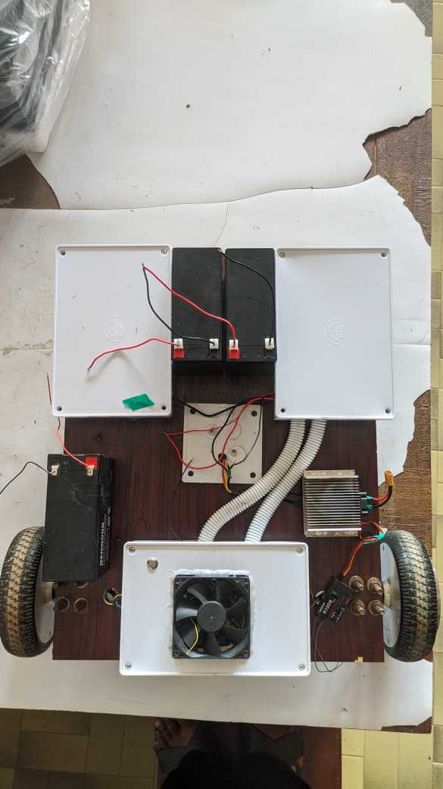
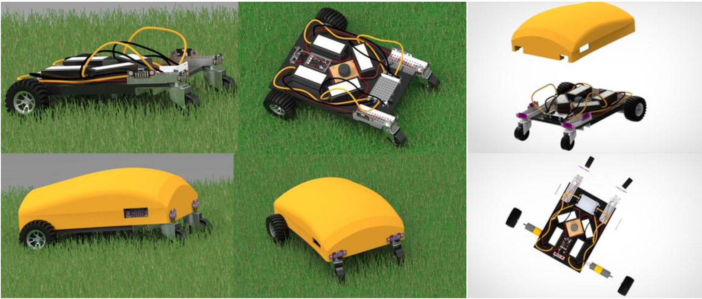

# ESP32-Based Autonomous Robotic Lawnmower

A WiFi-Controlled Autonomous Lawnmower Built from Repurposed Hoverboard Components



## 1. Overview

The ESP32-Based Autonomous Robotic Lawnmower is a cost-effective, intelligent grass-cutting robot constructed from repurposed hoverboard components and an ESP32 microcontroller. It demonstrates professional-grade autonomous lawn maintenance capabilities while promoting environmental sustainability through hardware upcycling.

The project integrates Field-Oriented Control (FOC) motor algorithms, differential drive kinematics, WiFi teleoperation, and autonomous navigation into an accessible platform built from readily available consumer electronics.

## 2. Problem Statement (African Context)

In Nigeria and across Africa, lawn maintenance presents unique challenges that differ significantly from developed markets:

* **Labor and Time Constraints**: Manual grass cutting is labor-intensive and time-consuming, particularly in regions with year-round growing seasons and frequent rainfall that accelerate grass growth
* **Complete Absence of Robotic Solutions**: Commercial robotic lawnmowers ($1,000-$3,000+) are virtually non-existent in African households due to prohibitive costs, making lawn automation completely inaccessible to the average Nigerian family, institution, or small business
* **Economic Reality**: The cost of a single commercial robotic lawnmower exceeds several months of income for most African households, placing such technology entirely out of reach
* **Limited Access to Technology**: Advanced lawn care equipment is rarely available in local markets, with extremely high import costs, shipping fees, and complete absence of after-sales support or spare parts
* **Growing E-Waste Crisis**: Africa receives significant quantities of electronic waste, including discarded hoverboards, yet lacks infrastructure for proper recycling or repurposing
* **Educational Gap**: African universities and technical institutions need affordable robotics platforms for hands-on learning, but purpose-built educational robots are cost-prohibitive and unavailable locally
* **Climate Challenges**: Tropical and sub-tropical climates require frequent lawn maintenance (often weekly during rainy season), making automation particularly valuable but currently impossible for most users
* **Youth Unemployment**: Despite high unemployment rates, there's limited exposure to practical robotics and embedded systems skills that could create economic opportunities

Commercial solutions are designed exclusively for Western markets and are completely absent from African retail channels. Even if available, they fail to address African realities: astronomical costs relative to local incomes, zero serviceability, complete dependence on imported parts unavailable locally, and lack of adaptation to tropical conditions. There is an urgent need for affordable, locally-buildable autonomous lawn maintenance systems that leverage available resources while providing educational and economic value.

## 3. Solution Summary

This project transforms discarded or inexpensive hoverboards (typically $30-100 in Nigerian markets) into a sophisticated autonomous lawnmower platform, **bringing robotic lawn care to Africa for the first time** by making it financially accessible. Where commercial solutions are completely absent, this demonstrates that professional-grade robotic systems can be developed sustainably and affordably using locally available components.

### Key Solution Components

**Hardware Repurposing:**
* Two hub motors from hoverboard (drive wheels)
* Hoverboard motherboard with STM32 microprocessor and FOC firmware
* 42V lithium battery pack (2-3 hours runtime)
* Total material cost: ~$150 (vs. $1,000+ for commercial solutions)

**Control System:**
* ESP32 microcontroller for sensor processing and autonomous navigation
* Emmanuel Feru's FOC firmware for precise motor control on hoverboard motherboard
* Four HC-SR04 ultrasonic sensors for obstacle detection
* Dual-voltage architecture (42V for motors, 5V for logic)

**Autonomous Navigation Modes:**
* Spiral pattern coverage (deterministic, sensor-independent)
* Obstacle avoidance (reactive, sensor-based)

### Mechanical Design


*CAD model showing component layout and mechanical assembly*

The platform features:
* Differential drive configuration using hoverboard hub motors as drive wheels
* Front caster wheels for stability and smooth turning
* Centrally-mounted 3542 brushless cutting motor
* Rigid chassis providing structural support and component accessibility
* Strategic sensor placement for 180-degree frontal coverage

## 4. Features

### Drive System

* Field-Oriented Control (FOC) firmware on hoverboard motherboard
* Hoverboard motherboard with STM32 microprocessor
* Two hub motors (brushless DC) from hoverboard
* Differential drive kinematics for precise maneuvering
* Zero-radius turning capability
* 42V battery pack with 2-3 hours continuous operation

### Cutting System

* 3542 brushless motor with ESC
* Effective grass processing at various heights
* Centrally mounted for balanced weight distribution
* Blade guard and debris deflection

### Control & Sensing

* ESP32 microcontroller with WiFi connectivity
* Four HC-SR04 ultrasonic sensors (2cm-400cm range, 3mm resolution)
* LM2596S DC-DC converter for stable 5V logic
* Non-blocking firmware architecture for responsive control
* Temperature-controlled cooling fan

### Operating Modes

**1. Spiral Pattern Autonomous**
* Deterministic coverage algorithm
* Expanding spiral trajectory from starting position
* Sensor-independent (most reliable autonomous mode)
* Configurable parameters for different lawn geometries
* Systematic coverage of bounded areas

**2. Obstacle Avoidance Autonomous**
* Reactive navigation with sensor feedback
* Moves forward until obstacle detected, then executes avoidance maneuvers
* Implements backing up and turning behaviors
* Note: Limited effectiveness on lawns due to grass interference with ultrasonic sensors

## 5. How It Works

### System Architecture

```
42V Battery Pack
    |
    |---> Hoverboard Motherboard (FOC Firmware)
    |         |---> Left Hub Motor
    |         |---> Right Hub Motor
    |
    |---> Cutting Motor ESC
    |         |---> 3542 Brushless Cutting Motor
    |
    |---> 12V Tap --> LM2596S Converter --> 5V Logic
                            |
                            V
                      ESP32 Controller
                            |
                            |---> 4x HC-SR04 Sensors
                            |---> UART to Hoverboard Motherboard
                            |---> GPIO Fan Control
                            |---> Autonomous Navigation Algorithms
```

### Differential Drive Kinematics

* **Forward motion**: Equal positive velocities to both motors
* **Turning**: Vary speed difference between left and right motors
* **Zero-radius turns**: Drive motors in opposite directions at equal speeds
* **Precise control**: FOC algorithm ensures smooth torque regulation

### Communication Protocol

* ESP32 ↔ Hoverboard Motherboard: UART (configurable baud rate)
* ESP32 ↔ Sensors: GPIO (trigger/echo pulse measurement)
* Autonomous decision-making: On-board ESP32 processing

## 6. Results and Performance

### Autonomous Operation

* **Battery life**: 2+ hours continuous autonomous operation
* **Motor control**: Smooth acceleration/deceleration via FOC firmware
* **Cutting effectiveness**: Processes grass at various heights efficiently
* **Voltage stability**: LM2596S maintains stable 5V throughout discharge cycle
* **Navigation reliability**: Spiral pattern mode provides consistent coverage

### Autonomous Modes Performance

* **Spiral pattern**: Most reliable autonomous coverage for bounded areas
* **Obstacle avoidance**: Functional on hard surfaces, limited on lawns
* **Key limitation**: Ultrasonic sensors detect tall/wet grass as obstacles, causing erratic behavior

### Practical Insights

**What worked well:**
* FOC motor control on hoverboard motherboard delivered professional-grade performance
* Repurposed hoverboard hub motors and components proved robust and reliable
* Spiral pattern algorithm achieved systematic coverage without sensor dependency
* Cost-effective solution accessible to Nigerian students and researchers

**Key challenges identified:**
* Ultrasonic sensors unsuitable for lawn environments (grass interference)
* **Critical finding**: Perimeter wire boundary systems essential for reliable lawn operation
* Tall or wet grass causes false obstacle detection
* Sensor-based obstacle avoidance enters continuous loops on lawn surfaces
* Nigerian climate (frequent rainfall) exacerbates sensor interference issues

## 7. Technologies Used

**Hardware:**
* ESP32 microcontroller
* Hoverboard hub motors (2x brushless DC)
* Hoverboard motherboard (STM32-based with FOC firmware)
* 42V hoverboard battery pack
* 3542 brushless motor + ESC (cutting)
* HC-SR04 ultrasonic sensors (4x)
* LM2596S DC-DC buck converter
* ST-Link v2 programmer (for flashing FOC firmware)

**Firmware:**
* Emmanuel Feru's FOC firmware for hoverboard motherboard
* Arduino framework for ESP32
* Non-blocking millis()-based architecture
* Differential drive kinematics implementation
* Autonomous navigation algorithms (spiral pattern, obstacle avoidance)

**Software Development:**
* Arduino IDE
* UART serial communication
* Time-of-flight sensor processing
* Path planning algorithms

## 8. Future Improvements

### High Priority

* **Perimeter wire boundary system** (critical for reliable autonomous operation)
* Replace ultrasonic sensors with more suitable outdoor sensors
* GPS-based navigation and lawn mapping
* Improved traction system for uneven terrain

### Additional Enhancements

* LiDAR or vision-based obstacle detection
* Solar charging integration
* Rain detection and automatic docking
* Mobile app with enhanced features
* Multi-zone scheduling
* Grass height optimization algorithms
* Integration with smart home systems

## 9. Environmental Impact and African Context

This project demonstrates significant environmental, economic, and educational benefits particularly relevant to the African context:

**Sustainability:**
* Repurposes electronic waste (hoverboards) commonly imported into Nigeria
* Extends product lifecycle through modular design
* Reduces demand for new electronics manufacturing
* Promotes circular economy principles in African tech development
* Addresses growing e-waste challenges in Nigerian cities

**Economic Impact:**
* ~$250 total material cost makes robotic lawn care accessible for the first time in Africa
* Commercial alternatives completely non-existent in African retail markets
* When compared to Western prices ($1,000-$3,000+), represents 95%+ cost reduction
* Uses components actually available in local Nigerian markets (Computer Village Lagos, Benin City electronics markets)
* Eliminates impossible foreign exchange burden from importing expensive equipment
* Creates opportunities for local technical entrepreneurship and small-scale production
* Material cost equivalent to 3-4 months of manual grass cutting services in Nigeria

**Educational Value:**
* Hands-on robotics and embedded systems experience for African universities
* Demonstrates practical hardware upcycling relevant to African resource constraints
* Open-source design facilitates learning and adaptation across African institutions
* Addresses skill gaps in robotics, IoT, and autonomous systems
* Provides affordable research platform for Nigerian engineering students

**Local Context Benefits:**
* Addresses labor-intensive lawn maintenance in tropical climates
* Reduces exposure to manual cutting in snake-prone environments
* Suitable for Nigerian institutional campuses, estates, and compounds
* Can be maintained and repaired using locally available skills and tools

## 10. Build Guide

### Required Components

**From Hoverboard:**
* 2x Hub motors (brushless DC) with wheels
* Hoverboard motherboard (STM32-based)
* 42V lithium battery pack
* Charger

**Additional Electronics:**
* ESP32 development board
* 4x HC-SR04 ultrasonic sensors
* LM2596S DC-DC buck converter
* ST-Link v2 programmer
* 3542 brushless motor + ESC
* Wiring, connectors, heat shrink

**Mechanical:**
* Chassis material (aluminum/plywood)
* Caster wheels (front support)
* Mounting brackets
* Blade guard components


## 11. Contact
Blessed Ariagbofo
Email: bariagbofo@gmail.com

## 12. Acknowledgments

Special thanks to Emmanuel Feru for the open-source FOC firmware that made this project possible.

## 13. License

Open-source for educational and research use.  
Commercial use requires permission.

## 14. References

Key resources used in this project:

1. [Emmanuel Feru's FOC Firmware](https://github.com/EmanuelFeru/hoverboard-firmware-hack-FOC)
2. Lynch & Park - Modern Robotics: Mechanics, Planning, and Control
3. [HC-SR04 Ultrasonic Sensor Datasheet](https://cdn.sparkfun.com/datasheets/Sensors/Proximity/HCSR04.pdf)
4. [ESP32 Technical Reference Manual](https://www.espressif.com/)
5. [Robotic Mower Boundary Wires](https://robolever.com/robotic-mower-boundary-wires-how-they-work/)

---

**Contributions and improvements are welcome!** This project demonstrates that professional-grade autonomous systems can be built sustainably and affordably through hardware repurposing. Whether you're a student, hobbyist, or researcher, we encourage you to build upon this work and share your enhancements with the community.
